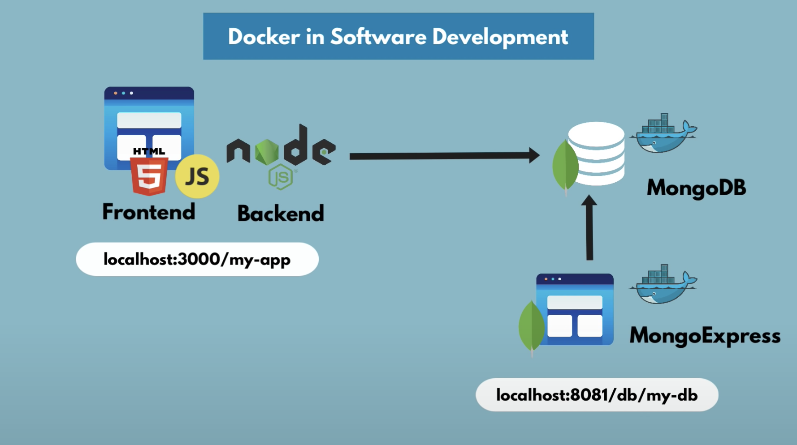
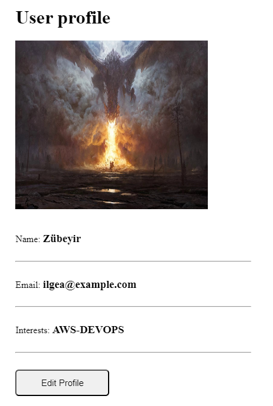

## Demo App - developing with Docker

[*Project Source*](https://www.youtube.com/watch?v=3c-iBn73dDE&ab_channel=TechWorldwithNana)

This demo app shows a simple user profile app set up using 
- index.html with pure js and css styles
- nodejs backend with express module
- mongodb for data storage

All components are docker-based

WebApp

### With Docker

#### To start the application

Step 1: Create docker network

    docker network create mongo-network 

Step 2: start mongodb 

    docker run -d -p 27017:27017 -e MONGO_INITDB_ROOT_USERNAME=admin -e MONGO_INITDB_ROOT_PASSWORD=password --name mongodb --net mongo-network mongo    

Step 3: start mongo-express
    
    docker run -d -p 8081:8081 -e ME_CONFIG_MONGODB_ADMINUSERNAME=admin -e ME_CONFIG_MONGODB_ADMINPASSWORD=password --net mongo-network --name mongo-express -e ME_CONFIG_MONGODB_SERVER=mongodb mongo-express   

_NOTE: creating docker-network in optional. You can start both containers in a default network. In this case, just emit `--net` flag in `docker run` command_

Step 4: open mongo-express from browser

    http://localhost:8081

Step 5: create `user-account` _db_ and `users` _collection_ in mongo-express
 
 _Bu 5. ve 6. adımı eğer uygulamayı konteynır içerisinde çalıştıracaksanız yapmayabilirsiniz. Bu adıma geldiğinizde Dockerfile'ın olduğu dizinde imajınızı oluşturun (build işlemi). Sonra onu çalıştırın (-p 3000:3000 ve parametresini eklemeyi unutmayın. Çünkü uygulamayı Docker ile çalıştırırken Docker Host'un 3000 portunu uygulama içindeki 3000 portuna yönlendirmeniz gerekir. Yerel olarak çalıştırdığınızda bu parametre gerekli değildir. Çünkü uygulama yerel makinede doğrudan 3000 portundan çalışır). 
 localhost:3000 sitesine girin. Edit Profile kısmına tıklayın. Değişiklik yapın ve Update Profile deyin. Daha sonra database'in arayüzüne (localhost:8081) gelip sayfayı yenile yapmanız yeterlidir. user-account ve onun altında users oluşmuş olacaktır._

Step 6: Start your nodejs application locally - go to `app` directory of project 

    npm install 
    node server.js
    
Step 7: Access you nodejs application UI from browser

    http://localhost:3000

### With Docker Compose

#### To start the application

Step 1: start mongodb and mongo-express

    docker-compose -f mongo.yaml up
    
_You can access the mongo-express under localhost:8081 from your browser_
    
Step 2: in mongo-express UI - create a new database "my-db"

_Uygulamade değişiklik yapıp, database'in arayüzünde sayfayı yenilediğinizde kendisi oluşuyor.
server.js içerisinde let databaseName = "user-account"; kısmını, hemen bir üstünde açıklandığı üzere my-db yapmalısınız. Yoksa gene user-account olarak oluşur. Aralarında bir fark yok. Neden my-db oluşmadığını buradan anlarsınız._

Step 3: in mongo-express UI - create a new collection "users" in the database "my-db"       
    
Step 4: start node server 

    npm install
    node server.js
    
Step 5: access the nodejs application from browser 

    http://localhost:3000

#### To build a docker image from the application

    docker build -t my-app:1.0 .       
    
The dot "." at the end of the command denotes location of the Dockerfile.
